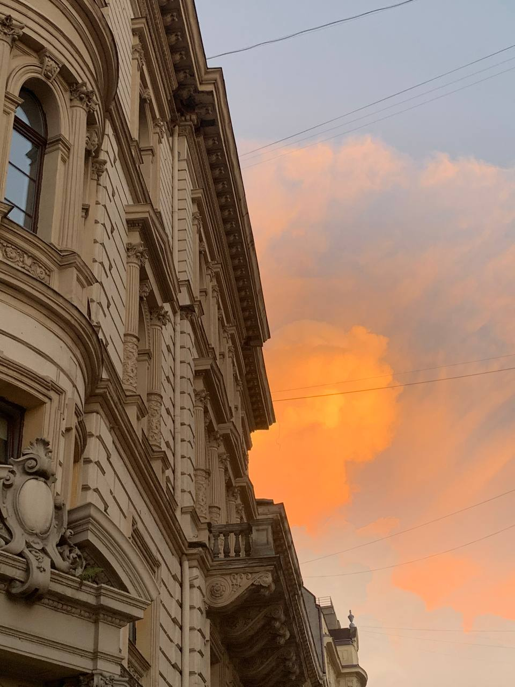

# Стеганографія та цифровий підпис зображення з RSA

Цей проєкт демонструє, як створити цифровий підпис зображення з використанням RSA, а потім приховати цей підпис у самому зображенні за допомогою методу LSB (Least Significant Bit). Після цього можна перевірити автентичність зображення, витягнувши та перевіривши підпис.

## Компоненти

### 1. Генерація RSA ключів

Перше за все, потрібно створити 4096-бітної RSA пару ключів (приватний + публічний), які використовуються для цифрового підпису та перевірки.
За це відповідає скрипт `generate_keys.py`.

**Результат:**  
- `private_key.pem`: використовується для підпису зображення.  
- `public_key.pem`: використовується для перевірки автентичності підпису.


### 2. Підпис зображення і приховування підпису (LSB-стеганографія)
Другий крок - це безпосередньо підпис зображення. За допомогою LSB-стеганографія підпис приховано вбудовується підпис у пікселі самого зображення.\
**! Варто зауважити**: скрипти розроблені для `.png` зображень. За це відповідає скрипт `sign_image.py`.


**Кроки:**
1. **Гешування зображення**  
   - Читається байтовий вміст зображення.
   - Обчислюється SHA-256 хеш (`hashlib.sha256`).

2. **Цифровий підпис**  
   - За допомогою `private_key.pem` підписується хеш.

3. **Вбудовування підпису у зображення**  
   - Підпис конвертується у бітовий рядок.
   - Кожен біт записується у найменш значущі біти пікселів (LSB) зображення (червоний, зелений, синій канали).
   - Модифіковане зображення зберігається (наприклад, `signed_image.png`).

Ось приклад оригінального зображення та його модифікації (ліворуч - оригінальне, праворуч - підписане):
<p align="center">
  
  
</p>

Різниця не помітна візульно. Це є головною перевагою алгоритму **стеганографії**. Він підписує зображення, залишаючи його візуально таким самим.
Також пробувала алгоритм конкатинації, проте в контексті візуальної змніи зображення, він працює значно гірше, ніж стеганографія.

### 3. Перевірка підпису

Мета цього кроку - перевірити, чи підписане зображення було змінене, та чи відповідає публічному ключу.  За це відповідає скрипт `verify_signature.py`.

**Кроки:**
1. **Витягування підпису з зображення**
   - Зчитуються найменш значущі біти з пікселів.
   - Зібрані біти конвертуються назад у байтовий масив підпису.

2. **Гешування оригінального зображення**
   - Так само, як і при підписуванні, зображення хешується з використанням SHA-256.

3. **Перевірка підпису**
   - Застосовується метод `verify_signature()` з відкритим ключем (`public_key.pem`).
   - Якщо підпис вірний — зображення справжнє.
   - Якщо підпис недійсний — зображення було змінено, або підпис не відповідає.

**Результат:**  
Виводиться повідомлення:  
«Підпис вірний!» або «Підпис недійсний!»


## Структура проєкту
```
ind-task-ozi/ 
├── generate_keys.py # Генерує публічний і приватний ключі
├── sign_image.py # Підписує зображення і вбудовує підпис 
├── verify_signature.py # Витягує і перевіряє підпис
├── original_image.png # Вихідне зображення
├── signed_image.png # Підписане зображення
├── private_key.pem # Приватний ключ (4096 біт)
├── public_key.pem # Відкритий ключ
├── requirements.txt # Залежності
└── README.md # Інструкція
```


## Встановлення

Для того, щоб запустити програму, потрібно виконати наступні кроки (виконати певний setup)

1. Встановити необіхідні модулі та бібліотеки (вони всі розміщені у файлі `requirements.txt`)

```bash
pip install -r requirements.txt
```

2. Згенерувати ключі:
```bash
python generate_keys.py
```

## Використання
1. Підписати зображення можна за допомогою:
```bash
python sign_image.py
```
2. Перевірити підпис
```bash
python verify_signature.py
```
